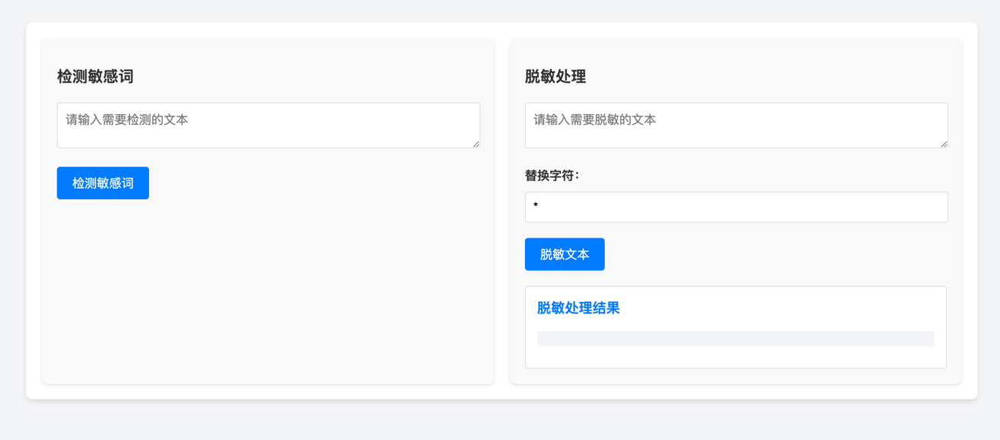

# Diting - A Sensitive Word Detection Component

`Diting` 是一个轻量级、可扩展的敏感词识别组件，支持多种方式加载敏感词库（TXT 文件、JSON 文件、MySQL 数据库、Redis），并提供基于 AC 自动机的高效敏感词匹配功能。

在中国神话中，谛听是地藏菩萨座下的神兽，它耳听八方，能辨善恶，能识真伪，是守护正义的象征。我们的项目 谛听（Diting） ，正是以此为灵感，致力于成为敏感数据识别领域的“神兽”！它用“耳朵”聆听每一段文本，用“智慧”辨别每一个敏感词，守护您的数据安全与内容合规。

## 目录

- [特性](#特性)
- [技术栈](#技术栈)
- [安装](#安装)
- [配置](#配置)
- [使用](#使用)
- [未来规划](#未来规划)
- [贡献](#贡献)
- [许可证](#许可证)
- [联系方式](#联系方式)
- [致谢](#致谢)

## 特性

- **多种敏感词加载方式**：支持从 TXT 文件、JSON 文件、MySQL 数据库和 Redis 中加载敏感词库，满足不同场景的需求。
- **高效敏感词匹配**：基于 Aho-Corasick 自动机算法，实现多敏感词的高效匹配。
- **实时敏感词替换**：提供敏感词检测和替换功能，支持自定义替换字符。
- **灵活的配置**：通过 Spring Boot 配置文件轻松管理加载器和其他相关设置。
- **可扩展架构**：设计模块化，便于未来功能的扩展和集成。

## 技术栈

- **Java 17**
- **Spring Boot 3.1.2**
- **Aho-Corasick 算法**
- **Maven / Gradle**
- **JUnit 5**
- **Mockito**

## 安装

### 前提条件

确保您的系统已安装以下软件：

- **Java Development Kit (JDK) 17 或更高版本**
- **Maven 3.6+** 或 **Gradle 6.0+**
- **Git**


### 克隆仓库

```bash
git clone https://github.com/yourusername/diting.git
cd diting
```
### 构建项目
- 使用 maven
```shell
mvn clean install
```
- 使用Gradle
```shell
gradle clean build
```
## 配置
Diting 的配置文件位于 src/main/resources/application.yml 或 application.properties。以下是一个使用 application.yml 的示例：
```yaml
sensitive-word:
  loaders:
    txt:
      enabled: true
      filePath: classpath:sensitive_words.txt
      delimiter: "\n"
    json:
      enabled: false
      filePath: /path/to/sensitive_words.json
    mysql:
      enabled: false
      table: sensitive_words
      columns: word
      conditions:
        status: active
    redis:
      enabled: false
      key: sensitive_words_key
  default-loader:
    enabled: true
```
#### 配置属性说明

| 属性                                      | 描述                        | 类型                     | 默认值  |
|-------------------------------------------|-----------------------------|--------------------------|---------|
| `sensitive-word.loaders.txt.enabled`      | 是否启用 TXT 加载器         | `boolean`                | `false` |
| `sensitive-word.loaders.txt.filePath`     | TXT 文件路径                 | `String`                 | `null`  |
| `sensitive-word.loaders.txt.delimiter`    | 分隔符                       | `String`                 | `"\n"`  |
| `sensitive-word.loaders.json.enabled`     | 是否启用 JSON 加载器         | `boolean`                | `false` |
| `sensitive-word.loaders.json.filePath`    | JSON 文件路径                | `String`                 | `null`  |
| `sensitive-word.loaders.mysql.enabled`    | 是否启用 MySQL 加载器        | `boolean`                | `false` |
| `sensitive-word.loaders.mysql.table`      | MySQL 表名                   | `String`                 | `null`  |
| `sensitive-word.loaders.mysql.columns`    | 列名                         | `String`                 | `null`  |
| `sensitive-word.loaders.mysql.conditions` | 查询条件                     | `Map<String, String>`    | `{}`    |
| `sensitive-word.loaders.redis.enabled`    | 是否启用 Redis 加载器        | `boolean`                | `false` |
| `sensitive-word.loaders.redis.key`        | Redis Key                    | `String`                 | `null`  |
| `sensitive-word.default-loader.enabled`   | 是否启用默认加载器           | `boolean`                | `true`  |

> 注意：确保仅启用您需要的加载器，以优化性能和资源使用。

----

## 使用
Diting 提供了 DitingUtil，可以在您的服务或控制器中直接调用其方法来检测和替换敏感词。
#### 注入 SensitiveWordService
```java
import com.rookie.diting.service.SensitiveWordService;
import org.springframework.beans.factory.annotation.Autowired;
import org.springframework.stereotype.Service;

@Service
public class YourService {
    public void processText(String text) {
        // 检测敏感词
        boolean contains = DitingUtil.containsSensitiveWord(text);
        if (contains) {
            // 获取敏感词
            Set<String> words = DitingUtil.getSensitiveWords(text);
            // 替换敏感词
            String sanitized = DitingUtil.replaceSensitiveWords(text, '*');
            // 处理逻辑
            System.out.println("包含敏感词：" + words);
            System.out.println("替换后的文本：" + sanitized);
        } else {
            // 无敏感词处理逻辑
            System.out.println("文本中不包含敏感词。");
        }
    }
}
```
#### DitingUtil 方法说明
- boolean containsSensitiveWord(String text) 检查文本是否包含敏感词。
- Set<String> getSensitiveWords(String text) 获取文本中的敏感词集合。
- String replaceSensitiveWords(String text, char replace)替换文本中的敏感词，使用指定的替换字符。

#### 开启谛听控制台
谛听`0.0.6以上`版本提供了敏感词检测和脱敏工具的控制台，这是一个可选的功能，可以通过简单的配置快速启用。

1. 在你的项目中，除了引入敏感词检测组件的依赖，还需要确保引入以下必要的 Web 和 Thymeleaf 依赖：
```xml
<dependencies>
    <!-- 敏感词检测组件 -->
    <dependency>
        <groupId>com.example</groupId>
        <artifactId>diting-spring-boot-starter</artifactId>
        <version>0.0.6</version>
    </dependency>
    
    <!-- Web Starter -->
    <dependency>
        <groupId>org.springframework.boot</groupId>
        <artifactId>spring-boot-starter-web</artifactId>
    </dependency>
    
    <!-- Thymeleaf Starter -->
    <dependency>
        <groupId>org.springframework.boot</groupId>
        <artifactId>spring-boot-starter-thymeleaf</artifactId>
    </dependency>
</dependencies>
```
>注意：
> - 如果项目中未引入 spring-boot-starter-web 和 spring-boot-starter-thymeleaf，控制台页面将无法正常运行。
> - 如果你已经使用其他模板引擎（如 FreeMarker），可以根据需要替换 Thymeleaf，但需要自行重写页面模板。

2. 在 application.yml 或 application.properties 文件中配置以下内容：
   - **使用 application.yml 配置**
       ```yml
       sensitive-word:
         console:
           enabled: true  # 启用控制台功能
       ```
   - **使用 application.properties 配置**
        ```properties
           sensitive-word.console.enabled=true  # 启用控制台功能
        ```
     > 控制台功能 默认开启，如果需要关闭，可以将 sensitive-word.console.enabled 设置为 false。

3. 当控制台功能启用后，启动项目后可以通过以下路径访问：
   - URL 地址: http://localhost:8080/sensitive-word-console

    页面功能包含两个主要区域：
   1.	检测敏感词：输入文本，检测其中是否包含敏感词，并展示检测结果。
   2.	脱敏处理：输入文本和替换字符，处理敏感词并展示脱敏后的结果。

4. 如果你需要自定义控制台页面，可以按以下步骤操作来覆盖默认模板文件
   1.	在你的项目的 src/main/resources/templates 目录中创建一个名为 sensitive-word-console.html 的文件。
   2.	修改或替换默认的控制台页面内容。

    修改样式 ：如果需要自定义页面样式，可以直接修改 Thymeleaf 模板中的 CSS，也可以引入你自己的样式文件。
   如果需要自定义页面样式，可以直接修改 Thymeleaf 模板中的 CSS，也可以引入你自己的样式文件。

## 未来规划

目前，Diting 主要提供了服务层的敏感词检测与替换功能。未来，我们计划引入以下功能以提升组件的易用性和集成性：
- API 接口
提供 RESTful API 端点，方便前端或其他服务通过 HTTP 请求调用敏感词检测与替换功能。
- SDK 包装
提供多语言 SDK（如 Python、JavaScript），简化不同平台和语言的集成过程。
- 动态敏感词管理
支持在运行时动态添加、删除或更新敏感词库，无需重启服务。
- 高级配置选项
提供更多的配置选项，如敏感词匹配模式、忽略大小写等。
- 日志与监控
集成日志记录和监控功能，帮助用户跟踪敏感词匹配情况和性能指标。

## 贡献

我们欢迎大家为这个项目做出贡献！如果你想贡献代码，请遵循以下步骤：

1. Fork 本仓库并将其克隆到本地。
2. 创建一个新分支（`git checkout -b feature/your-feature-name`）。
3. 进行修改并确保已充分测试。
4. 提交你的修改（`git commit -am 'Add new feature'`）。
5. 将更改推送到该分支（`git push origin feature/your-feature-name`）。
6. 提交一个 Pull Request（PR）到 `main` 分支。

在提交 Pull Request 前，请确保你的修改符合以下要求：
- 代码应当有良好的注释。
- 遵循项目的编码风格和规范。
- 新功能应有相应的测试，若适用。

如果有任何问题或需要帮助，请随时创建一个 Issue，我们会尽快为你提供帮助。

---

## 许可证

本项目采用 [MIT 许可证](LICENSE)，允许个人、学术或商业用途的代码使用、修改、分发和再许可。

---

## 联系方式

如果你有任何问题、建议或需要进一步了解项目的内容，可以通过以下方式联系我：

- **项目维护者**: [Jaguarliu](https://jaguarliu.me)
- **电子邮件**: 18829526908@163.com
- **GitHub**: [Eumenides1](https://github.com/Eumenides1)

---