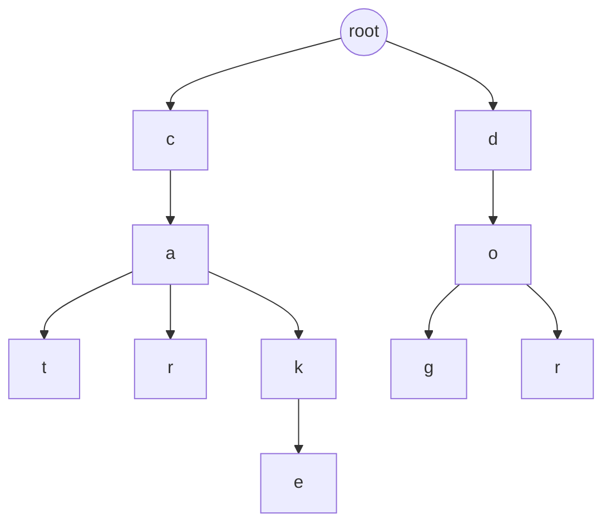
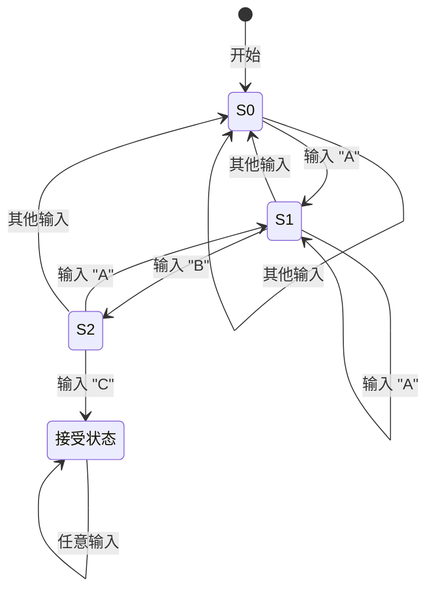
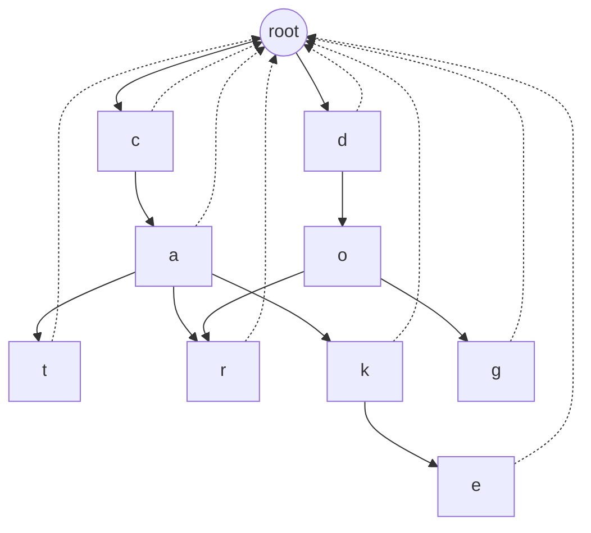

> 代码仓库：https://github.com/Eumenides1/diting

在前面的开发中，我们已经基本完成了谛听的加载器部分，实现了用户可以通过自定义配置的方式，选择不同类型的敏感词库加载器，加载自己业务的敏感词；完成敏感词加载之后，今天我们来继续，敏感词识别的核心 - **Aho-Corasick 自动机（AC 自动机）**。

## 前置知识 - Trie树
了解 **Trie** 是学习 **DFA** 和 **AC 自动机** 的重要基础，因为这三者之间存在递进关系。Trie 不仅是 DFA 和 AC 自动机的核心数据结构之一，还能帮助我们理解更高阶的自动化匹配算法中的设计思想。

### **Trie 是个啥？**

在计算机科学中，**Trie** 是一种树形数据结构，用于存储字符串（通常是单词）。它的名称来源于“retrieval”（检索），但一般念作“try”，因为英文里更好发音。

**核心特点**
- **逐字符存储**：Trie 将字符串拆分成字符，逐个字符作为树的节点。
- **路径唯一性**：从根节点到某一节点的路径代表某个字符串的前缀。
- **高效检索**：插入、查找、删除的时间复杂度与字符串的长度成线性关系，通常是  O(L) ，其中  L  是字符串长度。

想象一下，你是一个图书管理员，负责管理一本超大的字典，里面的单词多到让你头大。你的任务是：有人报个单词，比如“cat”，你得立刻告诉他这个单词在不在字典里，或者是否有其他单词以“ca”开头（比如“car”、“cake”）。传统的方法是翻遍字典一页页找，这效率可不怎么样。于是你灵机一动，发明了一个超级聪明的系统，这个系统的名字叫做 **Trie**！（读作 “try”，就是让你努力试试看！）

Trie（也叫前缀树）就像是一本超能分裂的魔法书。它不会按照传统的方法一页页地翻，而是直接把单词拆开成一个个字母，每个字母都是一条分支。它就像一棵树，树干是空的，树枝是字母，树叶是完整的单词。你在找单词时，走着字母的路径，就像顺着树枝爬，走到头，看看有没有结果。Trie 本质上是一个**有限状态机**（Finite State Machine, FSM）的雏形。每个节点都表示某个“状态”，而每条边是字符的“转移条件”。例如，在一个 Trie 中，你从 c -> a -> t 这条路径，就意味着通过状态转移形成了单词 “cat”。

我们举个栗子🌰：

假设你有以下单词：`cat、car、cake、dog、door`,普通方法：你得先从头到尾查“cat”，然后再从头到尾查“car”，单词一多，累得够呛。

Trie 方法：你说单词是字母堆出来的，对吧？Trie 直接用一棵树，把相同的字母合并共享：

看这棵字母树，单词共享了相同的前缀路径：

- “cat” 和 “car” 共用 `c -> a`。

- “cake” 又和“cat”和“car”共用了前两步，然后拐向了自己的分支。

- “dog” 和 “door” 一样，到了 `d -> o` 后才分开。

这么一搞，你想找“ca”开头的单词时，只要走到“ca”这一层，看它的子节点就知道下面有没有单词了，效率倍儿高！👀

### **Trie 的性格特征**

1. **爱分享**：相同的前缀字母只存一次，节省了很多空间。

2. **不啰嗦**：只存字母的路径，完整单词结束的地方会打个标记（比如一个特殊的 isWord=true）。

3. **速度达人**：查找单词时只需要按字母一路走，最坏情况是走完单词的长度。


### **用 Trie 的场景**

Trie 是个干活小能手，在以下场景下非常擅长：

- **字典查词**：比如找一个单词是不是存在，或者找以某个前缀开头的所有单词。
- **自动补全**：搜索引擎的自动补全功能，比如你敲了“ca”，它立刻提示“cat”、“car”、“cake”。
- **敏感词过滤**：快速找到某段文字里有没有包含敏感词。
- **拼写检查**：比如你输入了“caar”，它可以告诉你“car”是不是你想找的单词。

### **Trie 的小缺点**

当然啦，Trie 也不是完美的，有点“贪心”的性格——
- **空间吃得多**：虽然共享了前缀，但存储每个字母和节点也需要额外的空间。如果单词特别多，Trie 可能会长成一棵巨型的魔法树。
- **冷门字母也要存**：就算字母出现很少，比如 “x” 或 “q”，它也得为这些罕见路径预留节点。

----
## **确定性有限自动机（DFA）**

要真正理解 AC 自动机的强大之处，我们需要回顾一下它的“前身”——**确定性有限自动机（Deterministic Finite Automaton，简称 DFA）** ，并探讨它们之间的演变过程。让我们一起开启这段“自动机家族史”的旅程，看看 DFA 如何一步步演变成如今的 AC 自动机。

### **DFA 的基本概念**

**确定性有限自动机（DFA）** 是一种数学模型，用于识别和处理特定的字符串模式。它由以下几个部分组成：
- **状态（States）** ：表示自动机的不同“阶段”。
- **输入符号（Input Symbols）** ：自动机处理的字符集。
- **转移函数（Transition Function）** ：定义了自动机如何从一个状态转移到另一个状态，基于当前输入符号。
- **起始状态（Start State）** ：自动机开始处理输入的初始状态。
- **接受状态（Accept States）** ：表示自动机成功识别到模式的状态。

### **DFA 的工作原理**
让我们通过一个简单的例子来理解 DFA 的工作原理。
假设我们要构建一个 DFA，用于识别字符串中是否包含子字符串“ABC”。


1. **状态设计**：
    - **S0**：初始状态，尚未匹配任何字符。
    - **S1**：已匹配到“A”。
    - **S2**：已匹配到“AB”。
    - **S3**：已匹配到“ABC”（接受状态）。

2. **转移函数**：
    - 在 **S0**，输入“A”转移到 **S1**，其他输入保持在 **S0**。
    - 在 **S1**，输入“B”转移到 **S2**，输入“A”保持在 **S1**，其他输入回到 **S0**。
    - 在 **S2**，输入“C”转移到 **S3**，输入“A”转移到 **S1**，其他输入回到 **S0**。
    - 在 **S3**，保持在 **S3**（接受状态）。

3. **匹配过程**：
- 读取输入字符串中的每个字符，按照转移函数更新状态。
- 如果最终状态为接受状态 **S3**，则表示字符串中包含“ABC”。

### **DFA 的优缺点**
**优点**：
- **高效性**：DFA 的匹配过程是线性的，时间复杂度为 O(n)，其中 n 是输入字符串的长度。
- **确定性**：每个状态对每个输入符号有唯一的转移，避免了不确定性和回溯。

**缺点**：
- **状态爆炸**：对于复杂的模式或多个模式，DFA 的状态数量可能急剧增加，导致内存消耗大。
- **扩展性差**：在处理多个模式时，需要构建多个 DFA，难以高效地管理和匹配。

## **Aho-Corasick 自动机**
传统的 DFA 适用于单一模式的匹配。然而，在实际应用中，我们常常需要同时匹配多个模式。例如，在敏感词识别中，我们需要在文本中同时查找“坏蛋”、“贪婪”、“诚信”等多个敏感词。使用单个 DFA 分别匹配每个模式，不仅效率低下，还增加了系统的复杂性。
**Aho-Corasick 自动机的诞生**

为了解决多模式匹配的问题，**Alfred V. Aho** 和 **Margaret J. Corasick** 于 1975 年提出了 **Aho-Corasick 自动机**。它是一种能够在一个文本中同时搜索多个关键词的高效算法，结合了 DFA 和 Trie 树的优势，克服了传统 DFA 在多模式匹配中的不足。

### **AC 自动机的发展历程**
AC 自动机诞生于上世纪七十年代，那个时候计算资源有限，处理效率成为算法设计的核心考量。Aho 和 Corasick 提出的这一算法，凭借其线性时间复杂度（与文本长度和关键词数量成正比），迅速在多个领域得到了广泛应用，包括文本搜索、网络安全、自然语言处理等。

AC 自动机不仅仅能找到关键词，它还能告诉你这些关键词出现的位置，以及它们是如何相互交织的。这就像是一个聪明的侦探，能够在复杂的情节中迅速找出关键线索。

随着计算能力的提升和应用场景的扩展，AC 自动机不断演化，适应了现代敏感词识别的需求。如今，它不仅在静态文本处理中表现出色，还被应用于实时数据流、日志分析等动态场景中。
### **AC 自动机是如何运作的？**
要理解 AC 自动机的工作原理，我们可以将其分解为几个关键步骤：构建 Trie 树、构建失败指针，以及进行匹配。让我们一步一步来揭开这个“超级英雄”的神秘面纱。
#### **构建 Trie 树**
**Trie 树** 是 AC 自动机的基础，用于存储所有模式串（敏感词）。每个节点代表一个字符，路径上的字符组合起来就形成了一个敏感词。

我们依然使用我们在Trie 树部分使用的例子：


#### **构建失败指针**
构建 **失败指针** 是 AC 自动机的核心。失败指针的作用是，当匹配失败时，能够跳转到其他可能的匹配路径，而不需要从头重新开始匹配。

**失败指针规则**：
1. 根节点的直接子节点（c 和 d）的失败指针指向根节点。
2. 每个节点的失败指针通过以下方式构建：
    - 如果当前节点的字符无法匹配，则跳转到当前节点的父节点的失败指针所指向的节点。
    - 如果没有匹配的节点，失败指针指向根节点。


- 节点 c 和 d 的失败指针直接指向根节点。
- 节点 o2 的失败指针指向共享的 o 节点，因为 o 是其匹配的父路径。

#### **进行匹配**
匹配过程是 AC 自动机的核心应用场景。通过 Trie 树和失败指针，AC 自动机能够快速完成多模式匹配。

假设我们匹配文本："cattodoorcake"

**匹配过程**：
1. **开始匹配**：
    - 从根节点 root 开始，扫描文本的第一个字符 c。
    - 匹配到节点 c，继续扫描下一个字符。

2. **匹配** cat：
    - 第二个字符 a，匹配到节点 a。
    - 第三个字符 t，匹配到节点 t。
    - 到达 t 节点时，完成 cat 的匹配。

3. **处理** to **的失败**：
    - 下一个字符是 t，但 t 没有从 root 开始的路径。
    - **失败指针生效**：回到根节点 root，继续匹配下一个字符 o。
    - o 同样没有从根节点匹配的路径，失败指针继续指向根节点。

4. **匹配** door：
    - 扫描到字符 d，匹配到节点 d。
    - 下一个字符 o，匹配到节点 o。
    - 下一个字符 o，再次匹配到o节点。
    - 最后一个字符 r，匹配到节点 r，完成 door 的匹配。

5. **处理** ca **后的失败**：
    - 扫描到字符 c，匹配到节点 c。
    - 下一个字符 a，匹配到节点 a。
    - 接下来的字符是 k，匹配到节点 k。
    - 下一个字符是 e，匹配到节点 e，完成 cake 的匹配。

### **AC 自动机的优势**
- **线性时间复杂度**：AC 自动机的时间复杂度为 **O(n + m + z)** ，其中：
    - **n** 是文本的长度
    - **m** 是所有敏感词长度的总和
    - **z** 是匹配到的敏感词数量
    - **一次扫描**：文本只需扫描一次，极大提高了匹配效率。

- **多模式匹配**：
    - 无需为每个敏感词构建独立的 DFA，AC 自动机能够同时处理多个敏感词，避免了多次扫描文本的开销。
    - 前缀树的优势，前缀共享，提高内存利用效率。

----
## 代码实现
终于到了激动人心的代码时间，经过上述对于 AC 自动机相关知识的了解，我们开始在谛听中，实现我们的 AC 自动机，并完成敏感词匹配相关的功能。
### ACNode的定义
ACNode 是构建 Trie 树和失败指针的基本单位，也是自动机的一个最小节点单位，我们需要他能够：
1. 存储字符节点的子节点。
2. 有一个失败指针。
3. 标记当前节点是不是已经是敏感词结尾了。
4. 存储已经匹配到的节点字符。

```java
private static class ACNode {
    Map<Character, ACNode> children = new HashMap<>(); // 子节点映射
    ACNode failure = null; // 失败指针
    boolean isEnd = false; // 是否是敏感词结尾
    Set<String> output = new HashSet<>(); // 当前节点匹配到的敏感词集合

    ACNode() {}
}
```
假设敏感词为：`["cat", "car", "cake"]`，构造的 Trie 树部分节点如下：

- 根节点 root：
    - children 包含 c。
- 节点 c：
    - children 包含 a。
    - failure 指向 root。
- 节点 a：
    - children 包含 t, r, 和 k。
    - failure 指向 root。
- 节点 t：
    - isEnd = true。
    - output 包含 "cat"。
    - failure 指向 root。

----

### **构造 AC 自动机**
有了 ACNode 节点之后呢，我来开始构造我们的 AC 自动机，首先我们需要构造一颗 Trie 树。

**基本逻辑也很简单：** 每次从根节点 root 开始，将敏感词逐字符插入。如果字符不存在对应的子节点，则创建一个新的 ACNode；如果是敏感词的结尾，标记 isEnd = true，并将该词添加到 output 中。

```java
private void buildTrie(List<String> keywords) {
    for (String keyword : keywords) {
        ACNode node = root;
        for (char c : keyword.toCharArray()) {
            node = node.children.computeIfAbsent(c, k -> new ACNode());
        }
        node.isEnd = true;
        node.output.add(keyword);
    }
}
```
构造完成基础的 Trie 之后，我们开到 AC 自动机构造的重点，为每个节点构造失败指针。

其实构造失败指针的逻辑，也没有那么的复杂。

失败指针的目的是：**当我们匹配失败时，可以快速跳到另一个可能的匹配路径，而不用从头开始重新匹配。**
构建失败指针可以看作是：**为每个节点找到一个“备胎”节点，当正匹配路径失效时，就去找这个备胎继续匹配。**

**详细逻辑说明**
1. **初始化根节点的子节点**：
    - 根节点的子节点（直接连接到 root 的节点，比如 c 和 d）的失败指针直接指向 root。
    - 为什么？因为它们没有更深的前缀可供参考，如果失败了只能回到根节点重新开始。
2. **递归设置失败指针**：
    - 对于每个节点（比如 a），它的失败指针由**父节点的失败指针**来决定。
    - 如果父节点的失败指针指向的节点中存在当前字符 c，那么当前节点的失败指针指向这个匹配的节点。
    - 如果不存在，失败指针直接回到根节点。
3. **合并输出**：
    - 当前节点的输出集合需要包含**自己匹配的敏感词**和**失败指针所指节点的敏感词**。
    - 这样即使跳到了失败指针指向的节点，也不会遗漏匹配到的敏感词。
```java
private void buildFailurePointers() {
    Queue<ACNode> queue = new LinkedList<>();

    // 初始化根节点的直接子节点
    for (ACNode child : root.children.values()) {
        child.failure = root;
        queue.add(child);
    }

    while (!queue.isEmpty()) {
        ACNode current = queue.poll();

        for (Map.Entry<Character, ACNode> entry : current.children.entrySet()) {
            char c = entry.getKey();
            ACNode child = entry.getValue();

            // 设置 failure 指针
            ACNode failure = current.failure;
            while (failure != root && !failure.children.containsKey(c)) {
                failure = failure.failure;
            }
            if (failure.children.containsKey(c) && failure.children.get(c) != child) {
                child.failure = failure.children.get(c);
            } else {
                child.failure = root;
            }

            // 合并失败节点的输出
            child.output.addAll(child.failure.output);

            // 将子节点加入队列
            queue.add(child);
        }
    }
}
```
**类比解释：失败指针就像备用路线**

假设你要去商场，而商场有几条路径（Trie 树上的不同路径）。如果你走的路突然被封了（匹配失败），你需要通过导航（失败指针）找到一条备用路线。

1. 如果你是从家（root）出发，刚开始选了一条主干道（比如 c），但是没通，你就直接回家（root）重新找别的路。
2. 如果你走到了某个中间位置，比如 ca（a 节点），但是发现接下来的路（t）走不通，这时候你看 ca 的备选路线（父节点 c 的失败指针指向的节点里有没有 a），如果有，直接跳到那里继续走。
3. 如果实在没有备选路线，只能回到家（root）。

**最终失败指针构建后的结果**

```
(root)
  ├── c --> (失败: root)
  │    └── a --> (失败: root)
  │         ├── t (失败: root, 输出: ["cat"])
  │         └── r (失败: root, 输出: ["car"])
  └── d --> (失败: root)
       └── o --> (失败: root)
            ├── g (失败: root, 输出: ["dog"])
            └── o --> (失败: root)
                 └── r (失败: root, 输出: ["door"])
```

### 提供敏感词发现的方法
根据我们构造出的 AC 自动机，就能快速的实现一个敏感词发现的功能。
```java
public List<String> findSensitiveWords(String text) {
    List<String> sensitiveWords = new ArrayList<>();
    ACNode currentNode = root;
    char[] chars = text.toCharArray();

    for (char c : chars) {
        while (currentNode != root && !currentNode.children.containsKey(c)) {
            currentNode = currentNode.failure; // 失败跳转
        }
        currentNode = currentNode.children.getOrDefault(c, root);

        if (!currentNode.output.isEmpty()) {
            sensitiveWords.addAll(currentNode.output);
        }
    }
    return sensitiveWords;
}
```
- 从 root 开始，逐字符扫描目标文本。
- 如果字符匹配，进入下一个节点；如果不匹配，通过失败指针跳转。
- 如果当前节点有敏感词（output 非空），将其加入结果集合。

### 功能测试
```java
public static void main(String[] args) {
    List<String> keywords = Arrays.asList("cat", "car", "cake", "dog", "door");
    ACTrie acTrie = new ACTrie(keywords);

    String text = "caketcatcar";
    List<String> result = acTrie.findSensitiveWords(text);

    System.out.println("匹配到的敏感词：" + result); // 输出：匹配到的敏感词：[cake, cat, car]
}
```
## 总结
从 DFA 到 AC 自动机，敏感词识别技术经历了一次重要的演变。**确定性有限自动机（DFA）** 在单模式匹配中表现出色，但在多模式匹配中存在状态爆炸和扩展性差的问题。**Aho-Corasick 自动机（AC 自动机）** 通过引入 Trie 树和失败指针，成功解决了多模式匹配的效率和灵活性问题，成为敏感词识别领域的“超级英雄”。

**AC 自动机** 以其高效的线性时间复杂度、强大的多模式匹配能力和灵活的扩展性，成为现代敏感词识别系统的核心组件。通过合理的设计和优化，结合其他先进的算法和技术，AC 自动机能够为您的应用提供稳定、快速、准确的敏感词检测与替换功能，守护您的内容合规与用户体验。

**关键要点**：

• **理解 DFA**：掌握确定性有限自动机的基本原理和工作机制，为理解 AC 自动机奠定基础。

• **掌握 Trie 树与失败指针**：深入了解 Trie 树的构建与失败指针的设置，理解 AC 自动机如何高效地进行多模式匹配。

• **应用最佳实践**：通过优化敏感词列表、合理设置失败指针、并发处理、定期更新敏感词库等最佳实践，充分发挥 AC 自动机的优势。

希望这篇文章能帮助您更全面地理解 **AC 自动机** 的演变过程及其在敏感词识别中的应用。如果您有任何疑问或需要进一步的技术支持，欢迎随时与我们交流！

在接下来的开发中，我们将继续优化谛听的功能，支持更多数据源和高级特性，让谛听真正成为敏感词识别领域的“神兽”！

**PS**：敏感词们，谛听正在快速成长，你们准备好了吗？😎
